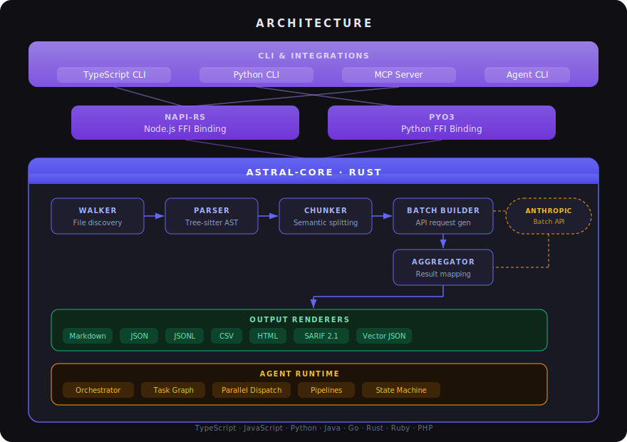

# astral

Analyse any codebase with Claude — at scale, at 50% cost.

astral parses a repository into semantic code chunks using tree-sitter, builds [Anthropic Batch API](https://docs.anthropic.com/en/docs/build-with-claude/batch-processing) requests, and returns structured analysis: summaries, code review, test generation, security audit, and documentation.

Works as a **CLI tool** and an **importable library** in both TypeScript and Python.

## Architecture

<p align="center">
  
</p>

---

## Quick start

### Prerequisites

- Rust 1.82+
- Node.js 18+ (for TypeScript CLI)
- Python 3.9+ (for Python CLI)
- An `ANTHROPIC_API_KEY` environment variable

### Install

Download the latest binary from [GitHub Releases](https://github.com/azharuddinkhan3005/astral/releases):

```bash
# macOS (Apple Silicon)
curl -L https://github.com/azharuddinkhan3005/astral/releases/latest/download/astral-darwin-arm64.tar.gz | tar xz
sudo mv astral /usr/local/bin/

# macOS (Intel)
curl -L https://github.com/azharuddinkhan3005/astral/releases/latest/download/astral-darwin-x64.tar.gz | tar xz
sudo mv astral /usr/local/bin/

# Linux
curl -L https://github.com/azharuddinkhan3005/astral/releases/latest/download/astral-linux-x64.tar.gz | tar xz
sudo mv astral /usr/local/bin/
```

Or build from source:

```bash
cargo install --git https://github.com/azharuddinkhan3005/astral.git astral-cli
```

Or for programmatic use:

```bash
npm install astral-code    # Node.js / TypeScript
pip install astral-code    # Python
```

### Usage

```bash
# Scan a repo — see what astral finds (no API call)
astral scan ./my-project

# Analyse — full pipeline with Claude Batch API
astral analyse ./my-project

# Dry run — show cost estimate without submitting
astral analyse ./my-project --dry-run

# Custom output formats
astral analyse ./my-project --output markdown,json,sarif,html

# Use a config file
astral analyse ./my-project --config astral.config.json

# Aggregate results from a previous batch
astral aggregate ./my-project results.jsonl --output markdown,html
```

---

## Configuration

Create an `astral.config.json` in your project root (all fields optional):

```json
{
  "include": ["src/**/*.ts", "src/**/*.py"],
  "exclude": ["**/*.test.ts", "**/node_modules/**"],
  "chunk_by": "function",
  "model": "claude-haiku-4-5-20251001",
  "max_tokens": 512,
  "analysis_mode": "summarise",
  "outputs": ["markdown", "json"],
  "output_dir": "./astral-output"
}
```

| Field | Default | Description |
|---|---|---|
| `include` | `[]` (all supported files) | Glob patterns to include |
| `exclude` | `[]` | Glob patterns to exclude (`.gitignore` is always respected) |
| `chunk_by` | `"function"` | Chunking granularity: `"function"`, `"class"`, or `"all"` |
| `model` | `"claude-haiku-4-5-20251001"` | Claude model for batch requests |
| `max_tokens` | `512` | Max output tokens per chunk analysis |
| `analysis_mode` | `"summarise"` | See [Analysis modes](#analysis-modes) |
| `outputs` | `["markdown", "json"]` | Output formats to generate |
| `output_dir` | `"./astral-output"` | Where to write output files |

---

## Analysis modes

| Mode | Description |
|---|---|
| `summarise` | What does this function/class do? Inputs, outputs, patterns. |
| `dependencies` | What does this depend on? What depends on it? Coupling analysis. |
| `code_review` | Bugs, code smells, missing error handling, performance issues. |
| `test_generation` | Generate unit tests covering happy paths, edge cases, errors. |
| `security_audit` | Injection vulnerabilities, auth issues, secrets, OWASP Top 10. |
| `doc_generation` | Generate JSDoc / docstrings / rustdoc appropriate to the language. |

Custom prompts:

```json
{
  "analysis_mode": { "custom": "Identify all TODO/FIXME comments and suggest fixes" }
}
```

---

## Output formats

| Format | Extension | Use case |
|---|---|---|
| `markdown` | `.md` | Human-readable report |
| `json` | `.json` | Machine-readable with stats |
| `jsonl` | `.jsonl` | Streaming-friendly, one result per line |
| `csv` | `.csv` | Spreadsheet analysis |
| `html` | `.html` | Interactive browser report |
| `sarif` | `.sarif.json` | GitHub Security tab integration |
| `vector` | `.vector.json` | Qdrant/Chroma embedding ingestion |

---

## Programmatic usage

### TypeScript / Node.js

```typescript
import { Analyser } from 'astral-code';

const analyser = new Analyser(JSON.stringify({
  model: 'claude-haiku-4-5-20251001',
  analysis_mode: 'code_review'
}));

// Scan and chunk a repository
const chunks = analyser.scan('/path/to/repo');
console.log(`Found ${chunks.length} code chunks`);

// Build batch requests (returns JSON string)
const requestsJson = analyser.buildRequests('/path/to/repo');

// Submit to Anthropic Batch API (your code)
// const batch = await anthropic.beta.messages.batches.create({ requests: JSON.parse(requestsJson) });

// After batch completes, aggregate results
const resultsJson = analyser.aggregateResults('/path/to/repo', rawJsonlFromBatchApi);

// Render to any format
const markdown = analyser.renderOutput(resultsJson, 'markdown');
const sarif = analyser.renderOutput(resultsJson, 'sarif');
```

### Python

```python
import json
from astral_code import Analyser

analyser = Analyser(json.dumps({
    "model": "claude-haiku-4-5-20251001",
    "analysis_mode": "security_audit"
}))

# Scan and chunk
chunks = analyser.scan("/path/to/repo")
print(f"Found {len(chunks)} code chunks")

# Build batch requests
requests_json = analyser.build_requests("/path/to/repo")

# Submit to Anthropic Batch API (your code)
# batch = client.beta.messages.batches.create(requests=json.loads(requests_json))

# After batch completes, aggregate
results_json = analyser.aggregate_results(raw_jsonl, "/path/to/repo")

# Render
markdown = analyser.render_output(results_json, "markdown")
sarif = analyser.render_output(results_json, "sarif")
```

---

## Agent pipelines

astral includes a multi-step agent orchestration system for complex workflows.

```bash
# Full analysis pipeline: scan → parse → batch → aggregate → render
astral agent analyse ./my-repo

# Security-focused review
astral agent review ./my-repo --mode security

# Generate tests for uncovered functions
astral agent generate-tests ./my-repo

# Everything: analysis + security + docs
astral agent full ./my-repo
```

### Pipeline task graphs

```
ANALYSE:    walk → parse [per language] → batch_build → render
REVIEW:     walk → parse → [security_audit ∥ code_review] → render_sarif
TEST:       walk → parse → test_runner → render
FULL:       walk → parse → [batch_build ∥ security_audit ∥ doc_gen] → render_all
```

### Agent model assignment

| Agent | Model | Rationale |
|---|---|---|
| Orchestrator | `claude-opus-4-6` | Strategic planning, synthesis |
| Walker, Parser, Batch Builder | `claude-haiku-4-5-20251001` | Mechanical, deterministic |
| Security Audit, Test Runner | `claude-sonnet-4-6` | Requires reasoning |
| Doc Generator, Renderer | `claude-haiku-4-5-20251001` | Structured templates |

---

## MCP server

astral exposes its capabilities as an [MCP](https://modelcontextprotocol.io/) tool server:

```bash
astral-mcp  # starts stdio transport
```

**Tools exposed:**

| Tool | Description |
|---|---|
| `astral_scan` | Scan a repo and return code chunks |
| `astral_analyse` | Scan + build batch requests |
| `astral_render` | Render results to any format |
| `astral_estimate_cost` | Estimate batch API cost |

Add to your MCP client config:

```json
{
  "mcpServers": {
    "astral": {
      "command": "astral-mcp"
    }
  }
}
```

---

## CI / GitHub Actions

### Security review on PRs

```yaml
# .github/workflows/astral-review.yml
name: astral security review
on:
  pull_request:
    branches: [main]

jobs:
  review:
    runs-on: ubuntu-latest
    steps:
      - uses: actions/checkout@v4

      - name: Run astral security audit
        env:
          ANTHROPIC_API_KEY: ${{ secrets.ANTHROPIC_API_KEY }}
        run: npx astral agent review . --mode security --output sarif --output-dir ./results

      - name: Upload SARIF
        uses: github/codeql-action/upload-sarif@v3
        with:
          sarif_file: ./results/astral-report.sarif.json
```

SARIF results appear natively in the GitHub **Security** tab on PRs.

---

## Language support

| Language | Extensions | Chunk types |
|---|---|---|
| TypeScript | `.ts`, `.tsx` | `function_declaration`, `method_definition`, `class_declaration`, `arrow_function` |
| JavaScript | `.js`, `.jsx` | Same as TypeScript |
| Python | `.py` | `function_definition`, `class_definition` |
| Java | `.java` | `method_declaration`, `class_declaration` |
| Go | `.go` | `function_declaration`, `method_declaration` |
| Rust | `.rs` | `function_item`, `impl_item` |
| Ruby | `.rb` | `method`, `class` |
| PHP | `.php` | `function_definition`, `class_declaration` |

Unsupported extensions are silently skipped. `.gitignore` rules are always respected.

---

## How it works

1. **Walk** — Traverse the repo respecting `.gitignore` and config globs
2. **Parse** — Tree-sitter parses each file into an AST
3. **Chunk** — Extract functions, classes, and modules as semantic chunks
4. **Build** — Generate one Batch API request per chunk with mode-appropriate system prompt
5. **Submit** — Send to Anthropic Batch API (50% cheaper than real-time)
6. **Poll** — Wait for batch completion (typically minutes)
7. **Aggregate** — Map results back to chunks via deterministic `custom_id`
8. **Render** — Output to configured formats

Chunk IDs are deterministic: `sha256(file_path + start_line)` — identical across runs on unchanged code.

---

## Cost estimation

Batch API pricing is **50% cheaper** than standard. Example estimates:

| Repo | Files | Chunks | Model | Est. cost |
|---|---|---|---|---|
| p-map (TS) | 8 | 142 | Haiku | ~$0.01 |
| requests (Python) | 34 | 763 | Haiku | ~$0.08 |
| gin (Go) | 59 | 528 | Haiku | ~$0.57 |
| lodash (JS) | 27 | 2,046 | Haiku | ~$0.65 |
| serde (Rust) | 55 | 2,206 | Haiku | ~$0.70 |
| gson (Java) | 271 | 3,662 | Haiku | ~$1.20 |

Use `--dry-run` to see exact estimates before submitting.

---

## Development

```bash
# Run all Rust tests
cargo test --workspace

# Run with clippy
cargo clippy --workspace -- -D warnings

# Check formatting
cargo fmt --check

# Dev build for Node
cd crates/node && npx napi build && npm link

# Dev build for Python
cd crates/python && maturin develop
```

### Project structure

```
astral/
├── crates/
│   ├── core/              # Rust core library
│   │   ├── src/
│   │   │   ├── lib.rs            # Data structures, Config, CoreAnalyser
│   │   │   ├── walker.rs         # Gitignore-aware file walking
│   │   │   ├── parser.rs         # Tree-sitter parsing (8 languages)
│   │   │   ├── chunker.rs        # Semantic code chunking
│   │   │   ├── batch_builder.rs  # Batch API request builder
│   │   │   ├── aggregator.rs     # Result aggregation
│   │   │   ├── outputs/          # 7 output format renderers
│   │   │   └── agent/            # Orchestrator, task graph, pipelines
│   │   └── tests/
│   ├── node/              # napi-rs binding + TypeScript CLI + MCP server
│   └── python/            # PyO3 binding + Python CLI
├── docs/                  # Architecture diagram
├── schema/                # JSON schemas
├── tests/fixtures/        # Test codebases (TS, Python, PHP)
└── .github/workflows/     # CI pipelines
```

## License

MIT
